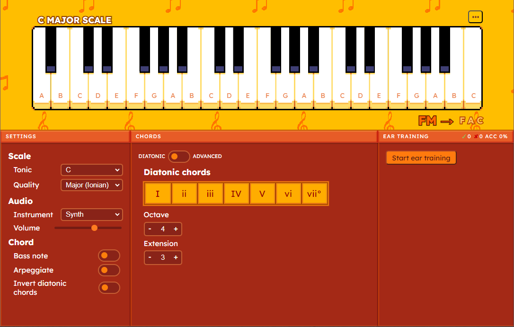
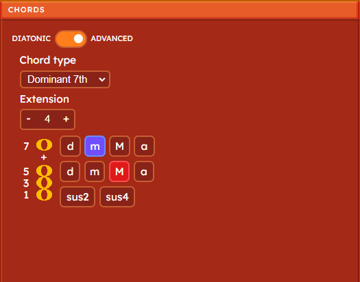
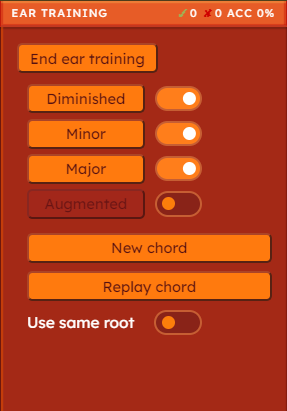

# Chord App

A simple music theory tool for exploring chords, scales, and practicing ear training. Built with Angular and Electron, using Tone.js for audio functionality.

*Note: This is a personal project intended for showcasing and personal use.*

## Features

- Build chords, either diatonic to a scale or customized through qualities and extensions. 
- Hear chords played by multiple instruments, with playback options like arpeggios, bass notes, and inversions.
- Visual piano that highlights played notes and allows direct interaction.
- Ear training mode to test chord quality recognition.

## Installation

- Download the installer [here](https://github.com/Renzo2323/chord-app/releases/latest).
- Run the installer.
- The app should open and appear in your Start menu.
  - If a shortcut isn't available, the app directory can be found by navigating to `%LOCALAPPDATA%\chord-app` in your file explorer.
  - You can create a shortcut by right-clicking `chord-app.exe` and selecting **Send to > Desktop (create shortcut)**

## Usage

  

  The app's layout is divided into four areas:

  - Piano display (Top)
  - Settings (Left)
  - Chords (Center)
  - Ear Training (Right)

### Piano Display

  The piano display will highlight the notes you play, and will also allow you to play chords by clicking any key. Keep in mind that
  you won't be able to play non-diatonic keys when in **Diatonic mode**.

  Above the display you'll find both the name of the currently selected scale, as well as a menu that lets you:
  - Highlight keys belonging to the selected scale.
  - Show/hide note labels.

  Below the display, whenever a chord is played, a chord indicator to the right displays the name (skipped for certain complex chords) and notes of the most recently played chord.

### Settings

  Here you can adjust the following settings:

#### Scale
  - Tonic: The note on which the scale begins. The home note of the scale.
  - Quality: The mode of the scale, like Ionian (Major), Aeolian (Minor), Dorian, etc.
#### Audio
  - Instrument: The instrument used on playback.
  - Volume
#### Chord
  - Bass Note: Adds the root note of the chord one octave lower.
  - Arpeggiate: Plays the chord's notes in succession instead of simultaneously.
  - Invert diatonic chords: Limits the range of diatonic chords (using the buttons in the "Chords" area) by inverting them, and changing the order of the notes.

### Chords

  In this area you can change between two modes:
  - Diatonic Mode
  - Advanced Mode

#### Diatonic Mode

  The diatonic chords of the scale are represented by seven buttons that can be clicked to play each chord. 
  
  Below, the octave the chord is played in and its extension can be adjusted (a triad is 3, a 7th chord is 4, etc.).

  You can also play these chords by using number keys 1 to 7.

#### Advanced Mode

In Advanced mode, you can select a preset chord type, or manually adjust the qualities of the triad (labeled "135") and each subsequent note added through the "Extension" setting (the quality of the extended notes represents the *root to extended note interval* quality).

The chords you play in the piano display will have this quality, and you will be free to play even non-diatonic notes.

### Ear Training

To begin ear training, click "Start ear training".

A chord will play (which will be affected by your settings), and you'll be
able to guess one of the enabled quality options. The correct answer will turn green, and if you
guess incorrectly, the selected option will turn red.

Use the toggles to the right of each option to enable/disable them.

To play a new chord, press "New chord", and to hear the same chord again, press "Replay chord".

You can also toggle "Use same root" to only play chords that start with the same root note, 
making the exercise easier.

At the top right, you can see your session stats, which are correct guesses, incorrect guesses, and accuracy.
